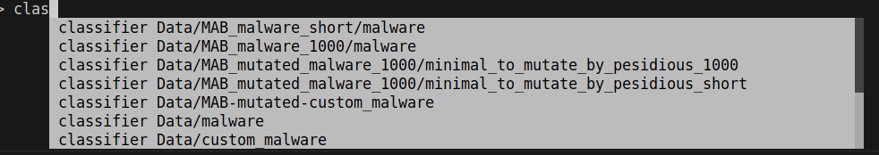
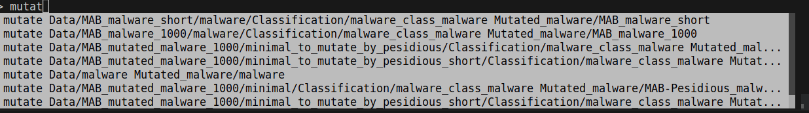
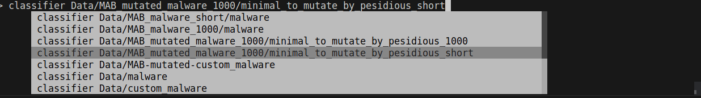
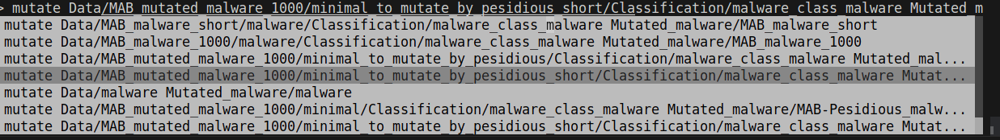
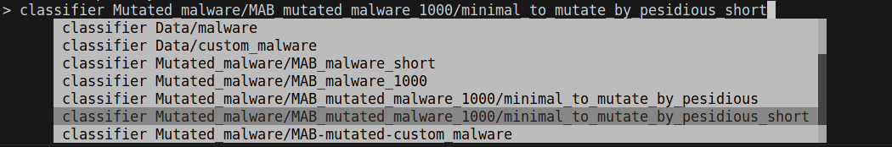
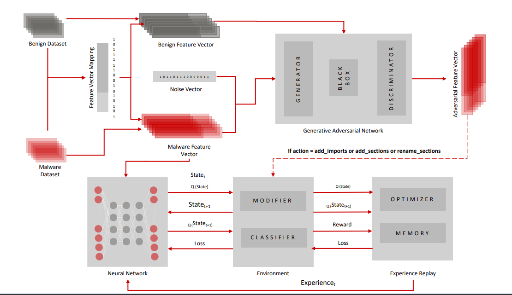
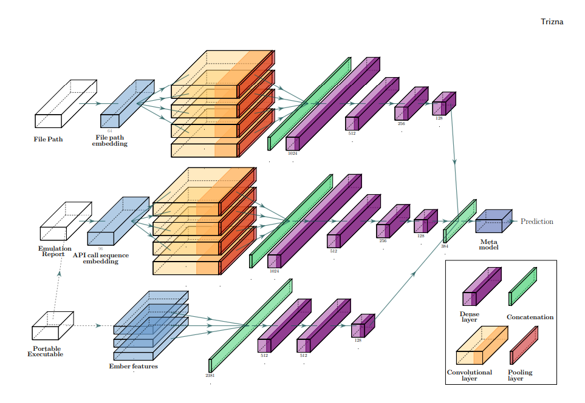
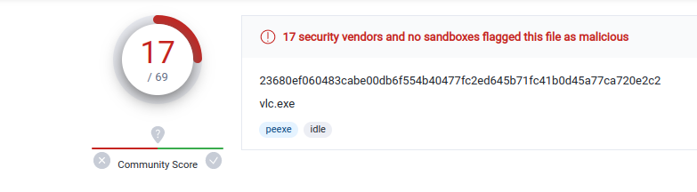

# NeoAthena framework : 
## Readme and Report Details 


**Since this framework deals with malware files, it is strongly advised that a virtual machine should be used or using Linux with extreme caution and taking the risk on your own. After installation of the framework, you must disconnect from the network. Only use for research and education purposes!**

## How to run NeoAthena

1. [Install and set up Python 3.6.](https://realpython.com/installing-python/)

2. Clone the repository.

    ```sh
    git clone https://github.com/wolfCuanhamaRWS/NeoAthena-framework.git

3. [Set up and activate a virtual environment with Python 3.6](https://docs.python.org/3/tutorial/venv.html)
    > It is recommended to use conda

### With virtual environment activated inside the directory Pesidious

1. Make sure that you have pip 8.1.1 installed and set up.
   > This is due to later versions of pip not playing well with the PyTorch libary.

   ```sh
   pip install pip==8.1.1
   ```

2. Install all the required libraries, by installing the requirements.txt file.

    ```sh
    pip install -r pip_requirements/requirements.txt
    ```

3. For information about MAB
[Click here to know how to fully run MAB without our script](https://github.com/weisong-ucr/MAB-malware)

### Run NeoAthena

1. On the terminal inside Pesidious with the virtual envirenment activated for python 3.6:
    1.1. Do sudo apt install docker.io ( if you dont have)

    1.2. Run the get_mab_malware.py to start using NeoAthena.

   ```
   python get_mab_malware.py
   ```

2. Choose the options depending on whether it is your first time or not using NeoAthena :

    2.1. Choose option 2 for the first time using NeoAthena
    2.2. Choose option 1 to integrate MAB with Pesidious
    2.3 Choose option 3 to get raw malware samples and integrate with Pesidious

3. Start using NeoAthena framework:
    3.1. Run the run_NeoAthena.py script to start using NeoAthena.

   ```
   python run_NeoAthena.py
   ```

4. On the menu, start writing mutate or classifier and many options will appear:

    4.1.  
    4.2.  
5. To replicate the results of the paper follow this flow:
    5.1. choose the option:  
        
    5.2. After all the classifications are doe, run again:

     ```
    python run_NeoAthena.py
    ```

    5.3. Choose the option: 
    5.4. After all the process of mutations of NeoAthena finish run again:

     ```
    python run_NeoAthena.py
    ```

    5.5. Choose the option to classify the mutated malware with mutations using MAB and Pesidious:
        

    5.6 Now, the total evasive sample will be on the directories: 
    - Mutated_malware/MAB_mutated_malware_1000/minimal_to_mutate_by_pesidious_short/Classification/malware_class_benign 
    - Data/MAB_mutated_malware_1000/minimal_to_mutate_by_pesidious_short/Classification/malware_class_benign

## Results:

### Evading the gradient-boost classifier and VirusTotal us-ing the NeoAthena framework

    1. Out of 40 MAB-mutated malware samples sorted by
    gradient boost:
        a.  35% are classified as benign: 14 out of 40
        b.  65% is rated by malware: 26 out of 40
    2. After the process with the NeoAthena framework ( MAB
    and Pesidious mutations)
        a.  77.5% evade the gradient-boost classifier
        b.  22.5% is classified as malware
    3. The best sample has a score of 12 / 71 in VirusTotal
    (MAB and Pesidious mutations)
    4. Link for VirusTotal best sample submission [40](https://www.virustotal.com/gui/file/3d63c59fc80b92ba67a8a5b2d3c1effa8ab5f70a224be06287bf359958c370a8/detection)
    5. Link for the cloud-based dynamic analysis[42](https://app.any.run/tasks/d1352f87-cbdb-465d-b635-77ba162b1edb)
    6. The above cloud-based dynamic analysis doesn’t detect
    any malicious behavior.
    7. The total of 31 mutated evasive samples  in 40 are on the directories: Results/MAB and Results/NeoAthena_MAB_Pesidious on the NeoAthena Directory .
    8 . Running more then one time, we get more then 31 / 40 = 77.5%, so for better and robust results, in the future choose some number of arbitrary times to run NeoAthena on malware and get an average result is a good idea .
    9. The minimum results using the Shellter sample are below.

# Details for the report

## Pesidious

### Pesidious framework image for the report



### Documentation

[Click here](https://vaya97chandni.gitbook.io/pesidious/)

### Repository for framework requirements, virtual environment, issues and some references

[Click here](https://github.com/CyberForce/Pesidious)

### Presentation online

[Click here](https://www.youtube.com/watch?v=aplHu2YMEFo&t=3354s&pp=ygUJUGVzaWRpb3Vz)

## MAB


### MAB Repository, requirements, Run docker image and run adversarial attacks

[Click here](https://github.com/weisong-ucr/MAB-malware)


## Quo-vadis

### Quo-vadis Repository, requirements and other informations

Generally we only used on the best samples, that already are on the quo-vadis directory to be used.
Later, better automatization needs to be done, so we run quo-vadis classifications on all mutated samples.

1. To run quo-vadis with our script, got to the quo-vadis directory:

    1.1. Run the run_quo_vadis.py script to start using quo.vadis inside NeoAthena.

    ```
    python run_NeoAthena_quo_vadis.py

    ```

2. Repository:  [quo-vadis](https://github.com/dtrizna/quo.vadis)

3. Arquitecture
    
    

## Other frameworks for comparison and future work

### Summary of the tools

- MalDiv is an automatic diversification mechanism that employs compiler-based transformations to generate an almost infinite number of binaries with identical functionality but minimal similarity, resulting in distinct signatures. It employs open judgments in the compiler to reorder and modify code and data, and it encrypts static data using a series of transformations. MalDiv enables malware distributors to generate an almost infinite number of undetectable binaries using signature-based matching.

- MalWASH is a dynamic diversification engine that runs unrestricted programs without alerting tools for dynamic analysis. In other terms, it is a malware engine that can modify existing malware to circumvent all behavioral and dynamic analysis detection techniques.

- TheFatRat is an exploiting utility that compiles malware with a well-known payload, which can then be run on Linux, Windows, Mac, and Android. TheFatRat makes it simple to generate backdoors and payloads that can circumvent the majority of anti-virus software.

- Shellter is a tool for injecting shellcode dynamically into native Windows applications. It utilizes the original structure of the PE file without making any modifications. It employs a unique dynamic approach based on the execution flow of the target application, and its sophisticated infection engine never redirects the execution flow to a code burrow or an added section of an infected PE file. Among other tecnhiques.

#### Links

[Shellter](https://www.shellterproject.com/)

[TheFatRat](https://github.com/screetsec/TheFatRat)

[MalWASH](https://github.com/HexHive/malWASH)

[MalDiv](https://github.com/gannimo/MalDiv)

### Comparision of results using Shellter

Due to limited time, only malware using shellter has been relatively developed in order to have malware samples that are easily integrated into the NeoAthena framework in the future.

#### Using shellter we get a malware sample that:

1. Used on Kali Linux .
2. We will hide a backdoor (with the payload "Meterpreter_Reverse_TCP") malware on one of " 50 Best Windows 10 Apps to Use" : [VLC_App](https://get.videolan.org/vlc/3.0.18/win32/vlc-3.0.18-win32.exe) with "attacker" IP address 10.10.10.4, and port 8080 
3. After the process using Shellter we get the score of 17 in 69, that is a litle worse then our 12 in 71 using NeoAthena.
4. In future we will integrate shellter and other frameworks on NeoAthena to try improve results.
5. The sample created using Shellter is on Results/shellter directory on NeoAthena . 
6. This is a "new" sample, another one was deleted when migrating all NeoAthena code for a new repository. But they use the exactly same tecniques and benign .exe file, also have the same score.




# References
All the references are in the report ( on NeoAthena directory):
[Evolving_Malware__Using_AI_to_Outsmart_Static_and_Dynamic_Analysis_(2).pdf](https://github.com/wolfCuanhamaRWS/NeoAthena-framework/files/11594506/Evolving_Malware__Using_AI_to_Outsmart_Static_and_Dynamic_Analysis_.2.pdf)

